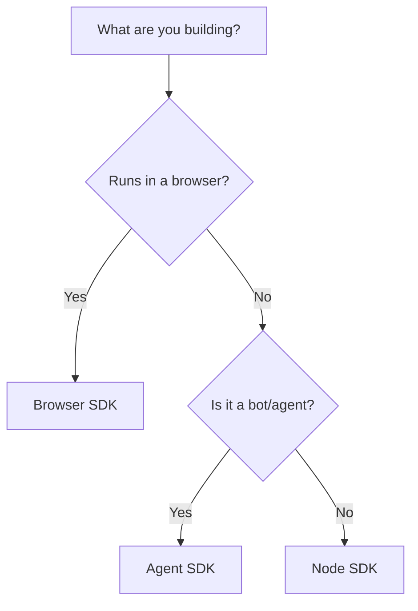

This is the official repository for XMTP client SDKs and content types for browsers and Node, written in TypeScript.

To learn more about the contents of this repository, see this README and the READMEs provided in each workspace directory.

## Which SDK should I use?

XMTP offers SDKs for a variety of use cases. Whether you're building a chat app, an automated agent, or a custom messaging backend, there's an SDK for you. This guide will help you get started developing with JavaScript or TypeScript.

- **Browser SDK**: Use this if you want to build a **complete messaging web app** (like [xmtp.chat](https://xmtp.chat/)). Runs entirely in the browser using WASM and Web Workers.
- **Agent SDK**: Use this if you want to create a **bot that runs on a server** and replies to people messaging it. Built on top of the Node SDK with an event-driven middleware architecture.
- **Node SDK**: Use this if you want to build a **messaging app backend** or have **custom use cases beyond a bot/agent**. Provides direct Node.js bindings for full flexibility.

## What's inside?

### Apps

- [`xmtp.chat`](apps/xmtp.chat): A [web app for developers](https://xmtp.chat/) to experiment with XMTP
- [`xmtp.chat-api-service`](apps/xmtp.chat-api-service/): An API to use [Pinata's file storage](https://pinata.cloud/)

### SDKs

- [`agent-sdk`](sdks/agent-sdk): XMTP agent SDK for Node
- [`browser-sdk`](sdks/browser-sdk): XMTP client SDK for browsers
- [`node-sdk`](sdks/node-sdk): XMTP client SDK for Node

### Content types

- [`content-type-primitives`](content-types/content-type-primitives): Primitives for building custom XMTP content types
- [`content-type-group-updated`](content-types/content-type-group-updated): Content type for group update messages
- [`content-type-reaction`](content-types/content-type-reaction): Content type for reactions to messages
- [`content-type-read-receipt`](content-types/content-type-read-receipt): Content type for read receipts for messages
- [`content-type-remote-attachment`](content-types/content-type-remote-attachment): Content type for sending file attachments that are stored off-network
- [`content-type-reply`](content-types/content-type-reply): Content type for direct replies to messages
- [`content-type-text`](content-types/content-type-text): Content type for plain text messages
- [`content-type-transaction-reference`](content-types/content-type-transaction-reference): Content type for on-chain transaction references

## Contributing

See our [contribution guide](./CONTRIBUTING.md) to learn more about contributing to this project.
