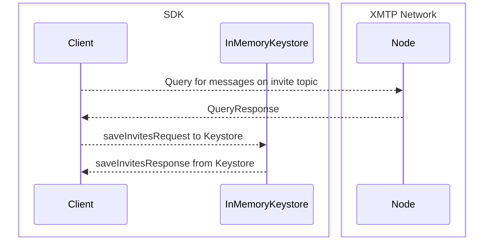
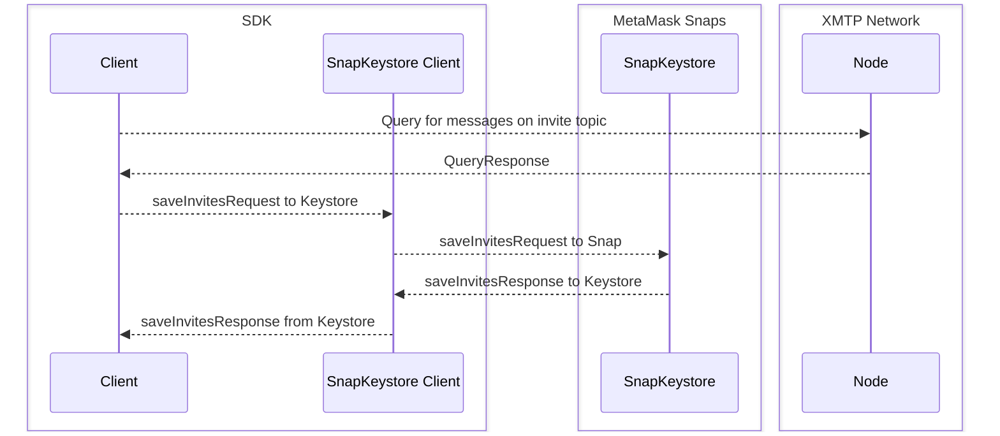

# Keystore

The Keystore module is responsible for all operations that involve the user's identity keys, prekeys, or conversation keys.

Keystores are responsible for encrypting, and storing, sensitive key material in their underlying persistence layer. There is a standard API [defined here](./interfaces.ts), with Protocol Buffer message types for serialization.

## Types of keystores

### `InMemoryKeystore`

This is the default Keystore that ships with `xmtp-js`. It lives inside the SDK and is accessed as a module. It can be configured to persist data with any valid [Persistence Provider](./persistence/interface.ts). The default persistence provider is `LocalStoragePersistence` in the browser and `InMemoryPersistence` in Node.js.

Here is a diagram of the interactions between the SDK, Keystore, and the XMTP node in this configuration:

### SnapKeystore

The `SnapKeystore` has a slightly different architecture than the `InMemoryKeystore`. When processing a request, the `SnapKeystore` client module found in this repository will serialize the request and send it to a MetaMask Snap, which lives inside the MetaMask browser extension. When a response is received, it will deserialize it and pass it back to the SDK.

You can learn more about MetaMask Snaps [here](https://docs.metamask.io/snaps/), and see the implementation of the XMTP Snap [here](https://github.com/xmtp/snap).

#### Installing and upgrading Snaps

If the `useSnaps` option is enabled, and the user has a compatible version of MetaMask installed in their browser, `xmtp-js` will attempt to install the "Sign in with XMTP" Snap as part of the client creation process. The SDK is responsible for installing or upgrading the correct version of the Snap using the following rules.

- If no instance of `@xmtp/snap` is already installed, install the version specified in [`snapInfo.json`](../snapInfo.json). This requires the user to accept a confirmation dialog in MetaMask.
- If the currently installed version of `@xmtp/snap` has a higher major version than the version specified in [`snapInfo.json`](../snapInfo.json), (for example, `snapInfo.json` specifies version `1.5` and MetaMask reports that version `2.1` is installed), installation will fail, and another Keystore provider will be used.
- If the currently installed version of `@xmtp/snap` is on the same major version, but a lower minor version (for example, `snapInfo.json` specifies `1.6` and MetaMask reports version `1.4` is installed), the SDK will attempt to upgrade the user to the version specified in `snapInfo.json`. This requires the user to accept a confirmation dialog in MetaMask.
- If the currently installed version of `@xmtp/snap` is _higher_ than the version specified in `snapInfo.json`, but is still on the same major version, do nothing and use the currently installed version. It is not possible to downgrade a Snap to a lower version.

Once the Snap is successfully installed, the SDK will check if the Snap is already storing keys for the current environment and wallet address. A Snap may already have keys stored because the user has already used your application with Snaps enabled in the past, or the user has used any other application using `xmtp-js` with Snaps enabled.

If the Snap already has keys for the current wallet address and environment, no further action is needed.

If the Snap does not yet have keys for the user, keys will either be downloaded from the XMTP network for the user and decrypted with a wallet signature, or created if it is the user's first time using the XMTP network.

## Making changes to the Keystore

Because the Snap lives in a completely different execution environment, and the source code comes from another repository, care must be taken when making changes to the Keystore.

First, you must decide if your change is non-breaking or breaking.

- Non-breaking changes include performance enhancements, code cleanup, or additional documentation. For non-breaking changes, you can simply commit the change to this repository.

- Breaking changes are things that alter the response format from the Keystore API in a way that an older client cannot handle. For example, adding a new method to the Keystore or changing the response type of an existing method.

If the intended change is breaking, you will need to design it in a backwards-compatible way. For example, instead of changing the response format of an existing Keystore method, create a new method instead and leave the old method in place.

You will then want to sequence the release as follows:

1. Update the files in the `keystore` folder in a backwards-compatible way, but do not make any changes outside of the Keystore folder. Merge to `main` to create a new release of `@xmtp/xmtp-js`. If you are introducing a new method, make sure to update [`rpcDefinitions.ts`](./rpcDefinitions.ts).
2. Upgrade the `xmtp-js` dependency in `@xmtp/snap` to the newly released version. Usually this will require no other code changes, since the Snap itself is a very thin wrapper around the `InMemoryKeystore` and `rpcDefinitions`. Merge to main to create a new release of `@xmtp/snap`.
3. Run `yarn updateSnapVersion` in the root of `xmtp-js` to update the version stored in `snapInfo.json`.
4. Make any changes required in the SDK to use your new Keystore method. For example, you may need to update some code to call your new API. Merge to main to create a new release.
